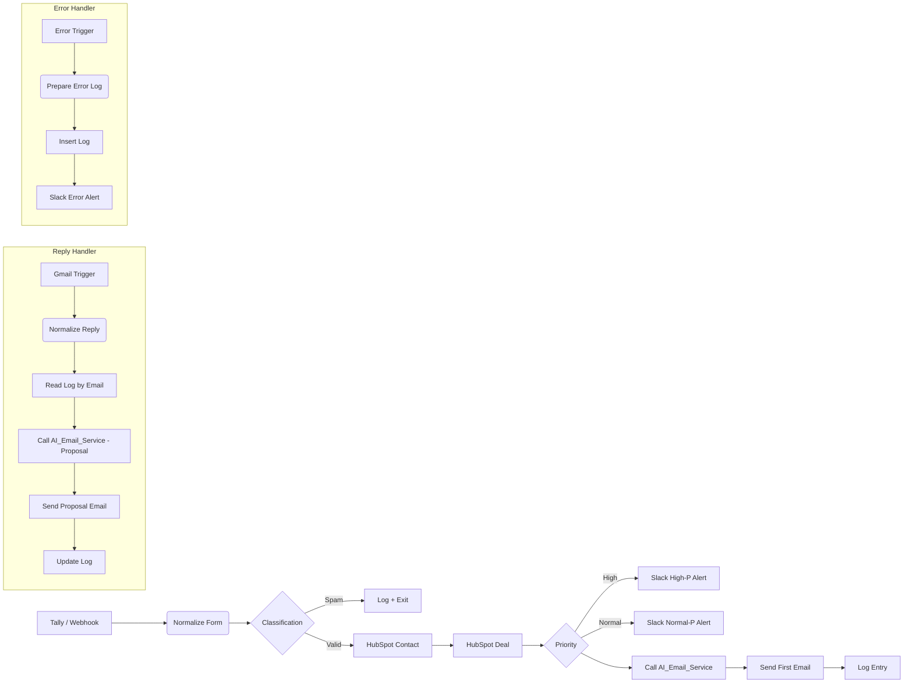

# 🚀 Automated Lead Processing & AI Email Engine

An end-to-end automated lead-processing system built on **n8n**, integrating:

- Tally / Webhook
- HubSpot CRM
- Gmail (AI-generated emails)
- Slack (alerts)
- OpenAI GPT-4.1-mini (email generation)
- Custom logging and error tracking engine

The system processes inbound demo requests, classifies the lead, enriches data, creates CRM objects, sends the first email, tracks replies, generates proposals, logs every step, and notifies the sales team.

---

## 🧩 System Overview

The automation consists of **4 main workflows**:

1. **Demo Request Workflow**
   - Handles new inbound demo requests from Tally
   - Creates/updates CRM records, classifies the lead, triggers alerts, sends the first email

2. **AI Email Service**
   - A reusable sub-workflow that generates:
     - First outreach emails
     - Commercial proposals (based on reply text + lead info + conversation memory)

3. **Reply Handler**
   - Parses incoming Gmail replies, fetches the CRM record and previous log entries
   - Generates a proposal, emails it back, and logs the action

4. **Error Handler**
   - Global workflow triggered on any failure
   - Extracts context, creates a log entry, and alerts Slack

---

## 🏆 Business Value

| Problem Before | Solution After |
|---|---|
| Leads processed manually (15–45 min each) | Automated processing in **<30 seconds** |
| Sales manager wrote outreach emails manually | AI drafts emails instantly |
| No consistent qualification or spam filtering | Smart classification via urgency, budget, domain flags |
| No clear SLA and inconsistent response times | SLA tied to lead priority: **2 hours vs 1 business day** |
| Manual proposal creation required reading replies | AI generates proposals using memory + reply text |
| Errors were hard to detect | Clear **error logs + Slack alerts with execution links** |

This automation increases lead-to-meeting conversion, reduces response times, and provides transparency into pipeline operations.

---

## 🧱 Architecture Diagram

---

## ⚙️ Key Features

### Intelligent Lead Classification

Based on budget, company size, urgency, email domain, consent flags, and UTM parameters. This reduces junk leads and prioritizes high-value prospects.

### Automatic CRM Enrichment

Each valid lead automatically becomes:
- HubSpot Contact
- HubSpot Deal (with budget, pipeline, & company)

### AI-Generated Emails

All emails use AI_Email_Service, which supports:

**Mode: first_email**
- Natural, professional outreach
- SLA included
- Personalized questions
- No Markdown, clean text only

**Mode: proposal**
- Summarizes client needs
- Structured plan
- Budget range aligned with their input
- Timeline + next steps
- Uses SimpleMemory to maintain conversation history

### Reply Tracking

Reply handler:
- Extracts sender email + thread ID
- Fetches previous log
- Decides the next step
- Sends a tailored proposal

### Logging Engine

All workflows write to a unified n8n Data Table: **Leads_log**

Each record includes:
- email, company, budget
- priority & classification
- contact_id, deal_id
- step, status
- error_message
- raw_execution (execution ID)

### Error Handling

If any workflow fails:
- Context is extracted
- Log entry is saved
- Slack alert includes:
  - Workflow name
  - Last executed node
  - Execution URL
  - Full error message

---

## 📂 Workflows Included

| File | Purpose |
|------|---------|
| `Demo_request_workflow (case 1).json` | Main entry point — classifies and processes new leads |
| `AI_Email_Service.json` | Reusable AI engine for writing all emails |
| `Reply_handler.json` | Generates proposals in reply to client messages |
| `Error_handler.json` | Centralized error logging + Slack alerts |

All workflow JSON files are available in `/workflows/` directory.

---

## 📘 Documentation

See `/docs/` for:

- **architecture.md** — component diagrams, flow explanation
- **data-schema.md** — schema of Leads_log
- Additional diagrams and sequence flows

---

## 🛠 Technologies Used

- **n8n** - Automation engine
- **HubSpot CRM API** - Customer data management
- **Slack API** - Team notifications
- **Gmail API** - Email handling
- **OpenAI GPT-4.1-mini** - AI email generation
- **n8n Cloud Data Table** - Custom logging

---

## 📞 Contact

For questions, demo access, or portfolio inquiries, feel free to reach out.